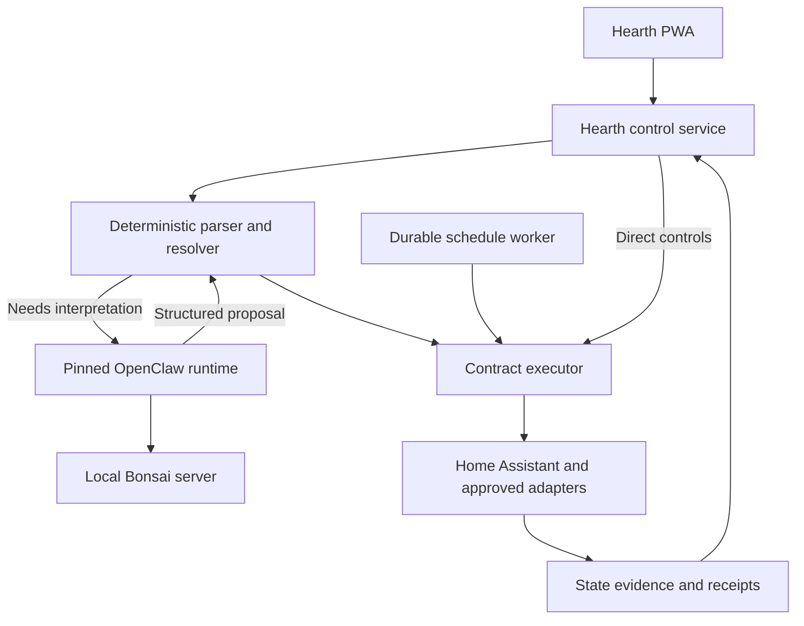

# Hearth development and delivery plan for Hermes

Version 3.0 | September 24, 2026 | Owner: Blake Sabatinelli

**Purpose:** Give Hermes an executable development plan to build, review, test and publish an installable, OpenClaw-based home management system to Blake's GitHub account, `blakesabatinelli`.

**Status:** Implementation specification. No repository, release, installation or household test is represented as completed by this document. Proposed repository name: `blakesabatinelli/hearth`; verify the actual destination before publishing.

This plan supersedes conflicting instructions in `HEARTH_BUILD_PLAN_2.md` v2.1. Preserve that review as historical input, not as a competing specification. The user’s current instructions take priority over either document.

## 1. Fixed requirements and roles

1. **Hermes is the development agent.** Hermes writes code, runs tests, reviews changes, fixes defects, prepares releases and uploads to GitHub. Hermes is not the installed household agent runtime. The finished application must work without Hermes, Claude Cowork, or the development machine being present.
2. **OpenClaw is the installed conversational runtime.** Hearth must actually use a pinned OpenClaw distribution and a tested integration with its Gateway or plugin interfaces. A generic chat app using the same model is not an acceptable substitute.
3. **Bonsai is the local language model family.** Start with a compact Bonsai 27B profile. Do not substitute Qwen, add a larger fallback model, or require cloud inference. Test the exact Bonsai checkpoint, format and serving runtime together. If it fails a gate, retain direct controls and supported grammar commands, improve the bounded interpretation path, or report the specific limitation.
4. **GitHub is the source and release home.** The code and installation assets belong under `blakesabatinelli`. Another supported device must be able to install a tagged release without access to the builder's filesystem, credentials or private machine addresses.
5. **SmartThings is optional and paid access is acceptable.** Its price model is not a reason to force migration, replacement or re-pairing. Keep existing working routes and add alternative routes where they provide demonstrated value.
6. **Discover broadly through the LAN and connected ecosystems.** Import devices from Home Assistant and supported Alexa account surfaces; use supported network discovery; retain SmartThings and Hue connections where useful. Discovery, identity, authorization, control and verification are separate capabilities.
7. **Provide one household interface.** Hearth includes Rooms, Favorites, Ask, Routines and Attention on phone and tablet. Home Assistant remains available for administration and independent manual fallback, not as the required second interface for normal Hearth controls.
8. **Keep control dependable without AI.** Direct controls and saved routines must survive failure of Bonsai and the OpenClaw process. They cannot depend on a live agent turn.
9. **Preserve existing household behavior during development.** Default to a simulated home. Live discovery is read-only. Live actuation requires a selected test-device allowlist. Re-pairing, deleting devices, disabling existing routines and expanding that allowlist are deliberate household changes.
10. **Continue autonomously through software gates.** Do not require Blake to approve every routine coding step. Pause for missing access or consequential household decisions, while continuing all unblocked fixture-based work.

House timezone: `America/Chicago`, configurable at installation. No reason has been provided to introduce America/Denver as a competing default.

## 2. Review of the attached plan

### Keep

The review improves the original proposal by specifying a deterministic grammar baseline, reusable Home Assistant metadata, fixture-based development, a labeled interpretation suite, code-generated receipts, versioned contracts, bounded retries, explicit recovery and a staged pilot. Preserve these ideas.

### Correct before implementation

| Review decision or claim | Assessment | Required correction |
| --- | --- | --- |
| Replace Bonsai with Qwen as the default | Conflicts with Blake's explicit model choice | Bonsai remains the model; characterize its limits on Hearth tasks |
| Migrate Zigbee/Z-Wave devices off SmartThings by default | Unnecessary disruption; subscription is acceptable | Preserve pairings and existing integrations; migration is optional |
| Delete upstream packages immediately | Creates maintenance risk before proving need or savings | Disable unused features first; prune packaged output only after dependency and resource measurements |
| Executor and scheduler are OpenClaw plugins, but survive killing Gateway | Internally inconsistent if they share Gateway's process | Run the control service independently; OpenClaw plugin is a restricted adapter |
| “Fork OpenClaw into a private GitHub fork” | GitHub public fork visibility imposes constraints [8] | Prefer a private standalone distribution repo with a pinned OpenClaw dependency/source reference; retain notices |
| All devices should be directly discoverable on the LAN | Not true for every radio or cloud device | Combine LAN discovery with hub/account imports; show gaps honestly |
| GLiNER2 is only flat extraction and cannot represent relations | Overstated; current project documents structured and relation extraction [7] | Evaluate its actual errors; do not infer reliability or impossibility from a single issue |
| Published Bonsai degradation and speed figures decide the model | Those figures are not a controlled Hearth evaluation | Remove unsupported selection thresholds; measure the selected model/runtime locally |
| Reuse all HA scenes as opaque actions | Can hide target scope and changes from the executor | Execute inspectable, frozen scene targets or use an explicitly attested scene route |
| HA dashboard for direct controls | Undermines one-app UX and does not pass through Hearth receipts | Build a small Hearth Rooms/Favorites view from HA metadata |
| A fresh `state_changed` event is the only proof of success | Misses already-satisfied states; an event may also be stale or optimistic | Use per-route evidence rules, explicit no-op results and post-dispatch reconciliation |
| Retry and identity fields are supplied by an agent | Risks policy and actor spoofing | Derive identity and safety policy server-side; store immutable contracts |
| Automatic wrong-target detection always disables the right category | Wrong intent may be invisible to software without user feedback | Add user reporting plus automated invariant detection; never claim complete automatic detection |
| N100 plus Mac plus coordinator is the required deployment | Hardware is unconfirmed and portability is under-specified | Ship separate supported deployment profiles; buy nothing to begin fixture development |
| Fixed HA platform and permissions assertions | Broader than evidence supports; HA documents a macOS VM path [10] | Probe exact versions, privileges and host support instead of treating blanket claims as requirements |
| A PR and human approval after every stage | Blocks progress on reversible work | Use objective software gates; report progress and request only necessary decisions |
| No clean install, release or upgrade specification | Material gap for the requested handoff | Treat packaging and second-device installation as release requirements |

No wholesale criticism of the earlier architecture is necessary: contracts and independent execution remain sound. The principal work is correcting changed requirements, separating processes, and specifying delivery.

## 3. Product scope

### First usable release

- Responsive, installable PWA with Rooms, Favorites, Ask, Routines and Attention.
- On/off, supported brightness, inspectable lighting scenes, time-based and sunset routines, temporary holds.
- Home Assistant connection and import of its areas, devices, entities and supported capabilities.
- Hue support through Home Assistant where available.
- SmartThings support through Home Assistant where useful, without mandatory re-pairing.
- Guided Alexa connection and a tested inventory/control capability report. Unsupported Alexa surfaces remain explicitly limited.
- Network discovery candidates plus account/hub imports reconciled into one home inventory.
- Grammar-first interpretation and Bonsai fallback through OpenClaw.
- Independent control service, persistent receipts, crash recovery, live test allowlist.
- Versioned GitHub release, installer, doctor, backup, upgrade, rollback and uninstall documentation.

### Deferred

Locks, garage doors, alarm disarming, water controls, heating appliances, cameras, purchases, firmware updates and autonomous repair. Unknown switches and outlets are not assumed to be lighting. Confirm their load type before admitting them to groups.

GLiNER2 remains an optional measured experiment after the baseline works. Jev and a trained Qwen classifier are outside this release. Local voice follows text control; a browser speech API must not be described as local speech recognition unless that execution path is verified.

## 4. Architecture and failure boundaries



The boxes for parser, executor and scheduler are modules of the independent control service, not necessarily separate containers. OpenClaw and Bonsai are separate processes. Stopping either must not stop the control service.

### Services

**hearth-control:** TypeScript service containing authenticated API, registry overlay, parser/resolver, policy, executor, schedule worker, event cache and receipts. Uses its own versioned SQLite database with durable transactions. Serves the static PWA. Holds the necessary HA/device credentials. Starts without OpenClaw or Bonsai.

**hearth-openclaw:** Pinned OpenClaw runtime with a narrow Hearth adapter and Bonsai provider configuration. Owns bounded conversational interpretation and session continuity. No household credential store, shell tools, general HTTP tools or device actuation tools. It cannot access the executor database or host Docker socket. Disable unneeded channels, heartbeat tasks, cloud providers and UI surfaces through supported configuration where possible.

**hearth-bonsai:** Supported local model server with pinned model files and runtime. Local to the installation or on a configured trusted LAN host. No fallback to another model. Model output is untrusted input to the resolver, even when syntactically valid.

**Home Assistant:** Existing or separately installed dependency providing the principal integration layer. Its metadata is imported; Hearth maintains only needed aliases, conceptual groups, cross-provider identity mappings, access rules, route choices and evidence policies. Do not build replacement device drivers when a supported integration works.

### One language request should not cause two reasoning calls

The API first runs deterministic parsing. A complete supported parse reaches the resolver without an agent turn. Otherwise the OpenClaw adapter performs one bounded Bonsai interpretation request. It returns structured proposed intent, not an executable command. Do not implement an outer LLM router that invokes another LLM inside `hearth.resolve`.

If the pinned OpenClaw runtime requires tool-style output to return structured proposals, expose only a side-effect-free `hearth.propose_intent` tool with a strict schema. Enforce a turn/call budget. Native unconstrained tool selection is not a requirement for controlling lights.

### Process and credential boundaries

Authenticate the user at the control API. Bind each interpretation to an opaque server-side request record. The model cannot select `actor_id`, role, allowed devices, retry limits or evidence requirements. Responses from OpenClaw must reference the active request and pass freshness checks. The executor rechecks permission immediately before each dispatch.

Network isolation and scoped service authentication supplement tool restrictions. Removing a tool from a prompt is not a credential boundary. Home Assistant may require broader integration privileges than Hearth members receive; enforce Hearth's own permissions and document the credential's actual reach.

## 5. OpenClaw foundation and repository strategy

### Meaning of built upon OpenClaw

The installed release contains or installs the pinned OpenClaw runtime. The integration test must demonstrate an Ask request passing through OpenClaw to Bonsai and returning a validated proposal. Stubbed adapters are for tests only and are never represented as this integration passing.

Use supported Gateway/plugin interfaces when available [1]. Record the exact release and source commit. Do not assume an upstream cron database, plugin directory layout, or deterministic cron callback exists until inspecting that version. Hearth owns scheduling in its independent control service, so it need not inherit OpenClaw's scheduling or retention semantics [2].

### Proposed GitHub project

Target: `blakesabatinelli/hearth`, private by default if newly created. This name is proposed, not a confirmed existing repository. Hermes must authenticate, inspect access, and reuse the intended repository if it exists. If an unrelated repository occupies the name, report the collision and propose another name; do not replace it.

Use a **standalone Hearth distribution repository** with a pinned dependency on OpenClaw or an exact upstream source build recipe. This still ships an OpenClaw-based application. It avoids the visibility constraints of a private native fork of a public GitHub repository [8]. If an existing Hearth downstream fork is already in use, preserve it and adapt this layout rather than creating a competing project.

Only fork or patch upstream source when an observed blocker requires it. Record the original SHA, patch, reason, test and removal condition. Preserve upstream copyright and license notices. Keep private household configuration out of Git regardless of repository visibility. Review security fixes promptly; do not use a quarterly schedule to delay a material security fix.

### Proposed logical layout

Adapt placement to the actual repository, but preserve ownership boundaries:

```text
README.md
AGENTS.md
STATE.md
HEARTH_UPSTREAM.md
LICENSE
THIRD_PARTY_NOTICES.md
package.json
pnpm-lock.yaml
apps/control/
apps/web/
packages/contracts/
packages/registry/
packages/interpreter/
packages/executor/
packages/routines/
packages/ha-adapter/
packages/discovery/
packages/openclaw-adapter/
packages/cli/
config/hearth.example.yaml
config/openclaw.example.json
models/bonsai.lock.json
deploy/compose.yaml
scripts/install.sh
scripts/upgrade.sh
scripts/uninstall.sh
tests/unit/
tests/integration/
tests/e2e/
tests/failure/
eval/commands/
eval/reports/
fixtures/home/
patches/CORE_PATCHES.md
docs/architecture.md
docs/decisions/
docs/install.md
docs/upgrade-and-rollback.md
docs/discovery.md
docs/operations.md
docs/compatibility.md
docs/reviews/
.github/workflows/ci.yml
.github/workflows/release.yml
```

Do not invent upstream package locations and reorganize OpenClaw around them. Core application code should be TypeScript; a native model server or optional later Python extractor is an external dependency, not a reason to rewrite the whole application.

## 6. Discovery and canonical device identity

### Discovery pipeline

1. Import authenticated Home Assistant areas, devices, entities and availability.
2. Import supported account inventory from connected platforms, including Alexa through a supported integration when available. Report what that interface actually exposes; Echo discovery is not proof that every third-party Alexa-linked device was enumerated.
3. Use supported LAN advertisements such as mDNS/zeroconf and SSDP. Home Assistant already provides discovery mechanisms; reuse them where practical [6]. Offer explicit IP/hostname entry when automatic discovery cannot cross network boundaries.
4. Connect existing Hue and SmartThings integrations without moving devices. Record cloud versus local dependencies.
5. Reconcile candidates by verified stable identifiers and user-confirmed mappings. Friendly-name similarity can suggest a duplicate but cannot silently merge devices.
6. Show a coverage report: **discovered**, **needs pairing/account link**, **controllable**, **state observable**, **verified route**, or **unsupported**. These are separate fields, not a single success badge.

Zigbee/Z-Wave children generally appear through their hub or coordinator, not as individual Wi-Fi hosts. VLANs, multicast filtering, disabled advertisements, Bluetooth range and closed APIs limit discovery. A network scan cannot supply credentials or create an unsupported integration. Do not brute-force or scan networks other than the configured home interfaces.

### Identity model

Each physical device gets a Hearth canonical ID, provider identifiers, one or more capability endpoints, room/floor, load type, aliases, and preferred routes. HA remains the metadata source for its entities; Hearth adds a versioned overlay and cross-provider mapping.

Use canonical device/capability identity for locks and ordering across routes. Merely locking a HA entity ID will not stop an Alexa alias from commanding the same load. Handle renames and removals explicitly. A replaced bulb must not automatically inherit consequential permissions based only on its name.

Prefer a local working route, but do not force migration from a reliable existing cloud route. Rank routes per capability and evidence quality. After a timeout, reconcile before falling back; a delayed primary command plus a fallback can otherwise create duplicate or conflicting effects.

### SmartThings policy

Paid access is an accepted option. Hermes should report current requirements and use the integration if it is useful. Subscription activation remains an account setup step, not a software-development blocker. Neither re-pairing nor decommissioning SmartThings is a release prerequisite.

### Alexa policy

Include Alexa capability discovery early, because it is part of the user's requested coverage. Use documented integration capabilities, account linking and MFA requirements [5]. Never claim a complete device inventory from a surface that only exposes Echo devices or routines.

For any selected command route, bind a fixed tested template to known targets. Treat opaque Alexa routines as compound external actions: inventory their affected devices before approving them. Do not send arbitrary model-generated text to Alexa. If scope cannot be established, exclude that routine from automatic execution and explain the gap.

## 7. Bonsai model and interpretation contract

### Model policy

Baseline candidate: original compact **Bonsai 27B 1-bit** model, matched to a documented serving runtime. Record the exact repository, revision, filename, format, hash, tokenizer/chat template and license. The name “Bonsai 27B” alone is insufficient. A Bonsai 2 variant can be tested if appropriate, but must not silently replace the selected profile or increase the advertised memory requirement.

The current PrismML repository distinguishes original Bonsai, ternary and Bonsai 2, with format-specific runtime requirements. Some formats need PrismML's runtime fork [3]. Do not assume a stock Ollama import or stock llama.cpp build supports every file. Prefer the documented compatible server and test its OpenClaw provider adapter. An OpenAI-compatible endpoint may be appropriate for structured generation; the previous blanket prohibition on `/v1` is not a substitute for a compatibility test.

Start text-only with a bounded context, for example 4K–8K tokens as a benchmark setting, and compact request-specific household context. Do not download a vision projector, code interpreter, web UI or extra model unless needed. Record model weight memory, runtime overhead, cache memory and peak total memory separately. Weights fitting on disk or in RAM does not prove acceptable latency.

### Lock file requirements

`models/bonsai.lock.json` must pin:

- Model family and exact checkpoint revision.
- Artifact filenames, SHA-256 digests and source URLs.
- License identifiers and notices.
- Serving runtime version/source commit and build profile.
- Tokenizer/template compatibility.
- Context limit, output budget and supported schema mechanism.
- Validated host architecture and backend.

No floating `latest` references in a released model profile. No weights committed into the application Git repository. First-run downloads verify integrity, support interruption and give size/disk requirements before starting.

### Grammar and fallback

The grammar must consume the whole utterance. Unknown trailing clauses, unsupported conjunctions, multiple exclusions, negation or unresolved time language reject the fast path. Never extract a recognized prefix and discard the rest.

Support explicit state-setting, supported brightness values, known scenes, groups with tested exclusions, and unambiguous temporary instructions. Distinguish lowering brightness **by** 10 percent from setting it **to** 10 percent. “A little dimmer” needs a configured increment and fresh state. “Tomorrow morning” needs an established household default or clarification.

Bonsai proposes intent, target phrases, exclusions, values, temporal conditions and unresolved fields. Code resolves IDs and applies policies. Restrict generated output with a schema where the backend supports it, then validate again server-side. Malformed or unsupported output causes clarification or failure, never silent repair into an action. Permit at most one bounded retry for formatting failure; no open-ended reasoning loop.

### Evaluation

Hermes creates at least 200 reviewed labeled cases from synthetic household fixtures. Blake's real phrases improve the suite but are not a prerequisite for starting. Labels must be manually checked against the inventory and semantics, not accepted from the same model being evaluated.

Hold out whole paraphrase clusters within supported intent families; test entire unsupported families separately for abstention. Measure exact contracts, wrong targets, dropped exclusions, invented targets, temporal errors, correct abstention, unnecessary clarification, p50/p95 latency and peak memory. Compare grammar-only, Bonsai-only and grammar-plus-Bonsai. Only add GLiNER2 if it measurably improves this baseline without unacceptable errors.

If Bonsai misses the gate, limit the affected command categories, improve templates/context, or clarify. Do not change the default to Qwen or a cloud model. Model choice is fixed; autonomous coverage is evidence-driven.

## 8. Contract executor and trustworthy results

### Authoritative contract

Persist a server-generated contract with request ID, authenticated principal, source, exact targets, exclusions, desired absolute values, entity/group/scene versions, state preconditions, expiry, allowed routes and per-target evidence policy. Retry policy and authorization are derived from server configuration.

The client submits an intent or a contract ID, never authoritative role or policy fields. Bind contracts and clarification answers to the initiating actor/session. Require payload consistency for duplicate request IDs: reuse of a key with different content is a conflict, not a free pass. Validate versions again at dispatch to avoid target changes between preview and execution.

### Relative actions and races

Resolve relative adjustments against fresh state while holding the canonical target lock and checking state version. Convert once to an absolute value for dispatch. If another user changes the device before dispatch, re-evaluate or reject the stale request; do not replay a precomputed adjustment against a different state. Retries use the frozen absolute target, never reapply the relative increment.

### Lifecycle and evidence

Track per-target outcomes and aggregate them into confirmed, partial, sent-unconfirmed, failed, cancelled or expired. Distinguish the following:

- **Already satisfied:** a sufficiently fresh observation already matches the requested state. Report a no-op; do not require a new event or claim Hearth changed it.
- **Observed after command:** a trustworthy fresh report matches the goal after dispatch. This supports the desired state, not necessarily exclusive causal attribution to Hearth.
- **Optimistic or cached only:** transport acknowledgment or a state echo is insufficient; report unconfirmed.
- **Unknown after failure:** retain uncertainty when the command may have executed but verification was lost.

Do not equate event arrival time with measurement freshness. Configure evidence per integration, using source timestamps or an actual supported refresh/read where possible. Reading a HA snapshot after reconnect does not inherently mean the physical device was just polled. Normalize brightness ranges and tolerances. Register watchers before sending so a fast state event is not missed.

### Dispatch and recovery

Persist an execution intent before sending. Serialize per canonical capability, use bounded concurrency across independent devices, and apply provider rate limits. Implement one active executor with a process/database lock; if later scaled, require cross-process fencing.

On restart, reconcile interrupted work without blindly sending it again. A fresh trustworthy observation may establish current goal satisfaction; otherwise produce an uncertain outcome. Never claim exactly-once physical effects. Explicit set commands may be retried only under a bounded, route-specific policy after reconciliation and while the request remains current. Do not retry expired or superseded work.

### Scenes and authorization

For Hearth scenes, freeze the complete target/value set. For imported HA or Hue scenes, resolve and version the known scope or attach an administrator-approved immutable scope record. Revalidate on changes. Opaque scripts and scenes can affect non-allowlisted devices and must not bypass the executor's checks simply because their entity name is allowlisted.

### Receipts and incident control

Generate operational summaries from code, preserving counts and uncertainty. An optional conversational explanation cannot replace the authoritative receipt. Give the UI a visible “wrong device” report and pause control. Automatically block invariant violations and disable a implicated language category after a verified incident. Do not claim software can always infer the user's intended device without feedback.

## 9. Scheduling, holds and state ownership

Use a small durable scheduler inside `hearth-control` with versioned routine definitions, next due time, timezone, conditions, missed-run policy and execution ledger. It must not invoke an LLM. Do not couple its survival to OpenClaw cron.

- Identify an occurrence by routine ID, version and scheduled timestamp. Transactionally claim it before execution.
- Ensure only one schedule worker is active. Recover abandoned claims using the execution ledger, not unconditional replay.
- Store UTC instants plus the IANA timezone for local schedules. For spring-forward gaps, default to skip; for a repeated fall-back time, default to one run. Display and document the choice.
- Compute sunset from configured coordinates, not an internet geolocation guess. Keep household location private.
- Define temporary instruction expiration separately from a request deadline. “Until midnight” must state which local date and what restoration behavior occurs.
- Explicit user commands supersede older routine actions. Holds suppress scheduled writes to affected targets until expiration or cancellation.
- Attribute Hearth-originated changes using request context and execution history so they do not create false manual holds. Unknown external changes follow a configurable conservative hold policy; expose the policy rather than asserting every state change was a physical press.
- Registry/group/scene changes require revalidation of saved routine scope. New devices do not silently join old frozen routines.
- Migrate an existing routine only after its current platform and effects are known and the household change is authorized. Prevent dual scheduling.

Store definitions until changed or deleted; default receipts to 30 days. Database maintenance must not block dispatch for long periods. Test clock jumps, late events, restarts and retention cleanup.

## 10. Household PWA and API

All normal Hearth controls use the control API, including Rooms/Favorites. Do not embed an unrestricted HA dashboard as a shortcut. Import metadata and render a small stable set of cards.

Required screens:

- **Home / Favorites:** quick controls and saved scenes; clear pending state.
- **Rooms:** consistent switches/dimmers, availability and relevant state age.
- **Ask:** text request, short clarification choices, concrete routine previews and receipts.
- **Routines:** next run, recent outcomes, enable/pause/edit/run-now and temporary holds.
- **Attention:** deduplicated faults with device and actionable next step.
- **Admin setup:** connection health, discovery candidates, merges, load types, aliases, permissions, test allowlist, model profile and backups.

Use session authentication, secure cookies, CSRF protection where applicable, request validation and per-actor permissions. A wall tablet is a limited principal. Offline UI shows stale state and does not queue actuation for later replay. Cached application assets may work offline; state-changing API calls must not be handled by a replaying service worker.

A network-served installable PWA needs an appropriate secure origin. Ship a documented HTTPS option with certificate trust instructions for the selected phone/tablet environment. Do not claim full installability based only on an HTTP localhost development test. Test small-screen navigation, touch targets, reconnect and login expiration on actual supported clients before certifying them.

## 11. Installation and portability contract

### Supported profiles

| Profile | Initial commitment | Required evidence |
| --- | --- | --- |
| Linux x86-64 control host | First production target; Compose-based control and OpenClaw services, existing HA endpoint | Clean install, restart, upgrade and rollback |
| Linux x86-64 with local Bonsai | Integrated inference when supported resources/backend are present | Exact checkpoint/backend memory and latency measurements |
| Linux control host with LAN Bonsai server | Supported topology; endpoint is configurable | Authentication/network restrictions and model-host outage test |
| Apple Silicon Bonsai server | Candidate native Metal or MLX profile | Native runtime test; do not assume Linux containers get Metal acceleration |
| Linux ARM64 control host | Secondary target | Build plus actual runtime tests before advertising support |
| Windows or macOS full control stack | Development or later support | Publish only after its own complete installation test |

These profiles do not require buying an N100 or a second machine. A single compatible host is valid. An existing separate HA appliance is also valid. Hardware choice follows measurements. Do not claim a host is certified because its container image builds under emulation.

### Installer behavior

The installed product must not require a source checkout or developer package manager. Provide downloadable versioned release assets and a small CLI wrapper around immutable image references. Provide a separate source-build path for development.

Installer must detect OS/architecture, check container runtime and disk space, validate config, create a private data directory, generate installation-specific credentials, pull exact image digests, configure endpoint connections, and wait for health checks. Default to demo or read-only setup, not household actuation. Print concrete next steps when HA credentials are absent.

Installation must never rewrite host firewall settings, re-pair a device or install a root certificate silently. For remote access, document an authenticated private access option; enabling it is optional. Model downloads may need internet during setup even though routine operation is local.

### Configuration portability

Commit templates only. Actual HA URLs/tokens, Alexa account sessions, private IPs, inventory, allowed devices and model cache live in installation-local storage. No `/Users/blake...`, development-host IPs, shell history or development tokens in releases. Environment substitutions must be explicit and validated.

Model endpoint and HA endpoint must work across container boundaries; container `localhost` is not the host computer. Provide Linux/macOS-specific networking instructions where needed. Discovery across VLANs or Docker networks is a separate documented capability, not something image installation automatically solves.

### Proposed CLI interface

Hermes must implement and document these commands or record a justified naming change. They are requirements, not commands already available:

```text
hearth install --version <released-version> --profile <supported-profile>
hearth configure
hearth doctor
hearth discover --read-only
hearth demo
hearth status
hearth backup --output <path>
hearth upgrade --version <released-version>
hearth rollback --version <previous-version>
hearth uninstall --keep-data
```

`doctor` reports versions, architecture, endpoint reachability, clock/timezone, credentials without printing them, database status, model identity, inference smoke result and discovery limitations. It must not operate devices.

### Upgrade and rollback

Publish a compatibility manifest linking app, OpenClaw, schema, model profile and runtime versions. Take a consistent database/config backup before a migration. Serialize migrations and test upgrading from the previous supported version. On failed startup, restore the previous image and compatible data snapshot. Do not run old code against a newer incompatible schema. Warn that restoring a snapshot can lose post-backup history. Pause scheduling during migration and reconcile on restart.

Uninstall stops services and preserves user data by default. Destructive purge requires an explicit separate option. A backup restore onto another device is a release test. Revalidate credentials, installation identity and physical device bindings; cloning a database must not create two active controllers issuing the same routines.

## 12. GitHub, CI and release workflow

### Repository access and ownership

Hermes uses an existing authenticated GitHub session or approved connector. Verify account/organization access to the exact `blakesabatinelli` destination. Do not print tokens or embed them in remotes or files. If authentication is unavailable, finish local code, tests and release packaging, then report exactly what access is missing. Never claim a push succeeded without checking the remote commit.

The user has requested code upload to their GitHub account. Prepare and push development branches and reviewable PRs as access permits. Respect existing branch protection and review requirements. A missing reviewer is not permission to bypass those controls; proceed with the branch/PR artifact and report the remaining merge step. Do not make the repository or package public unless the user requests that audience.

### CI on every change

- Frozen dependency installation and exact runtime versions.
- Lint, typecheck, unit tests and adapter contract tests.
- Fake-HA integration tests and UI end-to-end tests against a synthetic home.
- Secret scanning and checks for household data in tracked files and built layers.
- Contract authorization, malformed-model-output and prompt-injection fixtures.
- Build of release containers and compatibility manifest.
- Migration/recovery tests when affected by the change.

Do not run live home-control jobs in normal GitHub CI or expose the HA token to pull-request code. Use runtime-scoped local credentials for allowlisted household smoke tests. Cloud CI may use a mock Bonsai adapter for deterministic tests, but it must label that result. A real pinned Bonsai/OpenClaw evaluation is a separate required release report.

### Publishing

Use GitHub Actions to build from the exact reviewed commit. Publish application images to private GHCR packages, for example `ghcr.io/blakesabatinelli/hearth-control` and `ghcr.io/blakesabatinelli/hearth-openclaw`, if access is available. Match package visibility and pull permissions to repository intent; private repository access does not by itself prove private image pull access.

Use least-privilege workflow permissions, pin third-party actions by commit SHA, and separate PR validation from trusted release publishing. GitHub documents its registry publishing workflow [9]. Do not use an untrusted PR trigger with package-write or secret-bearing context.

Release assets must include:

1. Tagged source and exact commit SHA.
2. Versioned installer/CLI bundle and Compose manifest using immutable image digests.
3. Checksums and provenance/attestation where supported, plus an SBOM and license notices.
4. Model lock file and documented download procedure; weights only if their specific redistribution terms have been checked and intentionally supported.
5. Installation, configuration, upgrade, rollback and troubleshooting docs.
6. Compatibility matrix and actual tested host specifications.
7. Evaluation and code-review reports with limitations and unresolved items.
8. Release notes distinguishing demo-ready, pilot-ready and household-validated status.

If private GHCR access is unavailable, provide a tested source-build or release-bundle alternative. Do not silently make images public. Test install credentials with read-only package access on the clean target; development admin credentials are not an installation prerequisite.

## 13. Staged execution for Hermes

### Stage 0 — Repository and compatibility spike

**Work:** Read this plan and existing repository instructions. Inspect the proposed repository destination. Create `AGENTS.md`, `STATE.md`, decision log, fixture home and CI skeleton. Select an exact OpenClaw version, inspect its actual interfaces, and prove a restricted request round trip with the selected Bonsai server. Measure whether disabling unused features provides adequate footprint before changing source.

**Outputs:** Upstream lock, model lock draft, process diagram, version compatibility report, repository access report, runnable demo scaffold.

**Gate:** OpenClaw really starts; Bonsai produces a schema-checked sample through the adapter; fixture mode needs no household credentials. An unavailable live inference host may defer that benchmark, but does not block building the fixture-based control service. Mark the gate partial until real evidence exists.

### Stage 1 — Independent control core

**Work:** Implement registry overlay, fake HA adapter, authenticated API, durable contracts, serialization, actor binding, evidence rules, receipts and recovery. Add no-op, idempotency collision, stale-context, cancelled and superseded cases. Prevent opaque scene scope bypass.

**Outputs:** Executable service and tests; sample contract/receipt records; policy and evidence documentation.

**Gate:** Direct fixture controls and persisted routines infrastructure work with OpenClaw and Bonsai stopped. Process restart never blindly replays uncertain commands. Model-supplied authority fields cannot affect execution policy.

### Stage 2 — Integration and discovery

**Work:** Implement HA metadata/state synchronization, reconnect reconciliation and read-only discovery. Add guided Hue/SmartThings/Alexa connection paths through existing integrations. Reconcile duplicate identities; produce coverage matrix. Use smallest necessary connection privileges; document actual privileges.

**Outputs:** Discovery report, setup flow, redacted integration fixtures and unsupported-capability report.

**Gate:** Fixture discovery is complete and deterministic. When household access exists, each actual pilot device has a verified identity, load type, route and evidence policy. Missing account credentials block only that connector. No automatic re-pairing or scan-as-control claim.

### Stage 3 — Grammar and Bonsai interpretation

**Work:** Implement full-consumption parser, scoped context, Bonsai proposal schema, bounded fallback, resolver and clarification binding. Create and review labeled examples. Benchmark the exact model/runtime under concurrent control load. Do not promote fuzzy matches to execution solely because one candidate scores highest.

**Outputs:** Eval suite, command-category support matrix, metrics and ten worst misses with fixes or limitations.

**Gate:** Zero wrong-target/unauthorized proposals admitted to execution and zero silently dropped exclusions in the gate suite. Aim for at least 95 percent exact supported unambiguous interpretation; report abstentions separately. Unsupported categories clarify or remain disabled. No non-Bonsai default is introduced to make the numbers pass.

### Stage 4 — Complete household UI

**Work:** Build Rooms/Favorites, Ask, receipts, Attention, holds and routine editing. Use executor path for every Hearth control. Implement responsive layout, session expiry, offline behavior and secure-origin installation.

**Outputs:** Fixture-backed PWA, screenshot review, accessibility/touch checks and client compatibility report.

**Gate:** A new user can perform common lighting tasks in the demo without visiting HA. Network drops do not replay taps. UI reports uncertainty accurately. Actual phone/tablet testing is reported separately from browser automation.

### Stage 5 — Durable schedules and overrides

**Work:** Implement versioned definitions, occurrence claiming, missed-run policy, DST, sunset, holds, priority and conflict checks. Add upgrade/restart tests. Existing household routines stay untouched until specifically selected for migration.

**Outputs:** Schedule test report, editable routine previews and migration procedure.

**Gate:** Saved routines run with OpenClaw and Bonsai stopped. Restart, duplicate occurrence, both DST transitions, stale registry versions and manual override races pass. Self-generated events do not create unintended holds.

### Stage 6 — Package and independent review

**Work:** Build versioned images and installer, pin dependencies, add doctor/backup/upgrade/rollback, scan artifacts and review license obligations. Perform a separate review pass against the requirements rather than reviewing only the latest diff. Address all blocking findings.

**Outputs:** Release candidate, review report, installation docs, compatibility manifest, benchmark report.

**Gate:** A clean supported environment installs using the candidate artifacts, with no source tree mounted and no access to the development machine. Fake-HA tests pass; a separate real Bonsai/OpenClaw report exists for the certified profile. Install, upgrade, rollback and backup restoration are demonstrated. A VM may prove control packaging; it does not prove GPU performance on a different host.

### Stage 7 — GitHub delivery

**Work:** Push the exact reviewed source and verify the remote SHA. Open or update the review PR as appropriate. Follow branch/release policy, publish a versioned release or release candidate, verify asset digests and private package pull permissions. Reinstall the downloaded artifacts, not an untracked local build.

**Outputs to Blake:** Repository URL, branch/PR URL, commit SHA, release URL if published, copyable installation steps, support matrix, test summary and unresolved items.

**Gate:** Another supported device can retrieve and install the delivered artifact. If repository policy prevents merge/release, deliver the pushed branch/PR and built candidate with a precise remaining action. Do not call that a published release.

### Stage 8 — Household pilot and expansion

**Work:** After selecting pilot devices and obtaining local credentials, run live smoke tests, evaluate discovery gaps and observe daily use. Test relevant outages without disrupting unselected devices. Expand room coverage deliberately. Migrate a routine only when authorized.

**Gate:** A two-week observation report shows actual behavior, incidents, false confirmations, clarification rate and maintenance burden. This is a household validation gate, not a reason to withhold a correctly labeled software release candidate from GitHub. Further device classes require their own capabilities, evidence and policies.

## 14. Testing and acceptance matrix

| Area | Release evidence |
| --- | --- |
| OpenClaw foundation | Actual pinned Gateway/plugin round trip to Bonsai; runtime version recorded |
| Independence | Stopping OpenClaw and the model leaves direct controls and saved schedules functioning |
| Model policy | Bonsai lock verified; no Qwen/cloud fallback installed or silently configured |
| Scope | No wrong-device, unauthorized or excluded-target actuation in the release suite |
| Truthfulness | No false confirmed receipt; no-op, stale and optimistic states handled distinctly |
| Duplicate/race handling | Duplicate IDs, changed payload, scene changes, competing routes and manual edits tested |
| Discovery | Separate discovery/control/evidence fields; hub-only and unavailable platform cases represented |
| Scheduling | Restart, missed runs, forward/back DST, duplicate workers, holds and version changes tested |
| UI | Rooms/Favorites in Hearth, usable phone layout, no stale replay, actual secure-origin test |
| Portability | Clean installation from downloaded artifacts without development files or credentials |
| Upgrade | Supported schema migration and previous-version rollback with consistent data demonstrated |
| GitHub delivery | Correct owner/repo, remote commit verified, assets and package audience verified |
| Privacy | Secrets, private inventory, model weights and machine-specific paths absent from source/artifact layers |

Performance targets are initial goals, not excuses to fabricate support: UI pending feedback below 200 ms p95; grammar processing below 100 ms p95; supported local device completion around 2 seconds p95 when evidence is available. Measure Bonsai proposal latency instead of promising a hardware-independent 1.5-second bound. Report cold/warm inference, token budget, context, p50/p95, peak RAM, host and concurrent load. Keep the interface responsive while reasoning is pending, with a bounded timeout and cancellation.

Zero observed errors in a suite is not a guarantee of zero future errors. Do not weaken authorization or evidence rules to meet a latency target. Accuracy and truthful receipts outrank command coverage.

## 15. Hermes work discipline and review checklist

### Required progress record

Maintain `STATE.md` after each coherent milestone:

```text
Current stage:
Completed outputs:
Tests actually run and results:
Review findings fixed or outstanding:
Compatibility and model versions:
Blocked items and specific reason:
Next executable task:
Git branch and last pushed commit:
Release and installation status:
Household actuation mode:
```

Commit small coherent slices. Keep requirements linked to tests and release evidence. Record routine implementation choices in an ADR and continue; do not ask Blake to choose frameworks, file names or every parser detail.

### Review sequence

1. Verify requirements against the entire implementation, especially OpenClaw usage, Bonsai-only inference and portable delivery.
2. Inspect every side-effect route for executor bypass, actor spoofing, target drift, scene opacity and duplicate physical identity.
3. Inspect crash windows, stale evidence, no-op behavior and fallback timing.
4. Inspect model prompts/output validation and confirm untrusted device metadata cannot obtain new tools or authority.
5. Review package contents, Docker layers, release workflow permissions, license notices and installation dependencies.
6. Execute the clean-device procedure exactly as documented; repair any manual undocumented step.
7. Produce a findings report with severity, file reference, disposition and verification. If the same Hermes agent performs both passes, say so. Do not claim independent review that did not occur.

### Continue without waiting

Repository scaffolding, fixture implementation, tests, UI, packaging, documentation, code review and authorized GitHub branch upload can proceed without a complete real-home inventory. Missing hardware or connector credentials is a scoped blocker, not a reason to stop the entire project.

### Stop only at a concrete boundary

Ask for missing credentials/access, target repository ambiguity, intended package audience changes, hardware purchases, device re-pairing, live allowlist expansion, destructive migrations, or an essential requirement that cannot be met. Preserve completed work and give the smallest specific request that unblocks the next step. Never weaken repository protections or device permissions to proceed.

## 16. Handoff instruction to Hermes

> Build Hearth according to this plan. You are the builder and reviewer; OpenClaw is the installed runtime and Bonsai is the local language model. Start by inspecting the available repository and pinning actual compatible versions. Implement a fixture-backed control service and a complete household PWA, keep execution and scheduling independent of OpenClaw, and prove the real OpenClaw-to-Bonsai path. Preserve existing SmartThings/Hue pairings and make paid SmartThings an optional accepted route. Publish reviewable source and versioned installable artifacts to the intended repository under blakesabatinelli using available authorization. Test installation on a clean supported environment, not only on your development machine. Continue through all unblocked software work; record missing home access separately. Do not replace Bonsai with Qwen, force device migration, require Hermes on the target machine, or claim a release/pilot/test was completed without evidence.

## 17. Sources and verification notes

The attached v2.1 plan was reviewed in full. The following primary documentation was consulted on September 24, 2026. Pin and inspect actual source versions during implementation; documentation is not proof of a successful local test. Specific price, benchmark and retention figures from the review are not adopted as requirements.

1. OpenClaw external applications and Gateway integration: https://docs.openclaw.ai/gateway/external-apps
2. OpenClaw automations documentation: https://docs.openclaw.ai/automation/cron-jobs
3. PrismML Bonsai families and runtime compatibility: https://github.com/PrismML-Eng/Bonsai-demo
4. Home Assistant permission framework: https://developers.home-assistant.io/docs/auth_permissions/
5. Home Assistant Alexa Devices capabilities and limitations: https://www.home-assistant.io/integrations/alexa_devices/
6. Home Assistant zeroconf discovery: https://www.home-assistant.io/integrations/zeroconf/
7. GLiNER2 structured and relation extraction: https://github.com/fastino-ai/GLiNER2
8. GitHub fork permissions and visibility: https://docs.github.com/en/pull-requests/reference/forks
9. GitHub container publishing workflow: https://docs.github.com/en/actions/tutorials/publish-packages/publish-docker-images
10. Home Assistant macOS installation options: https://www.home-assistant.io/installation/macos/

The concrete defaults in this plan are engineering recommendations for Blake's personal installation. Unverified model speed, universal discovery, blanket HA feature limitations and purported immutable reviewer decisions are not treated as facts.
